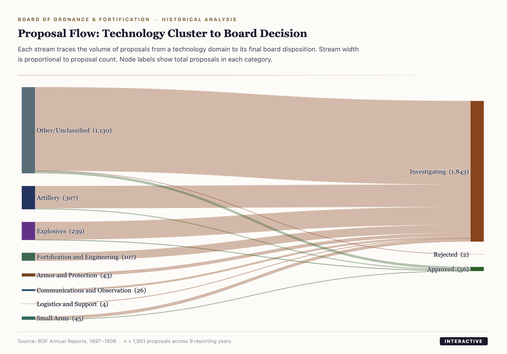
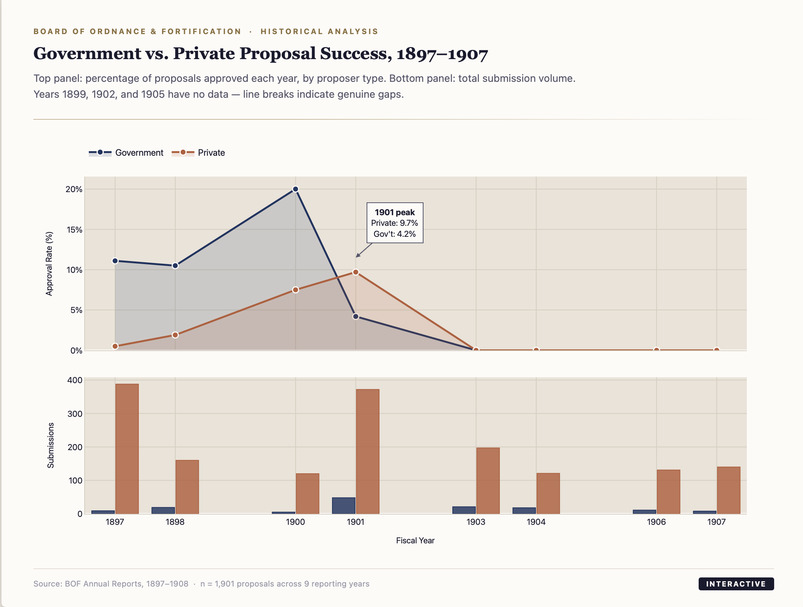
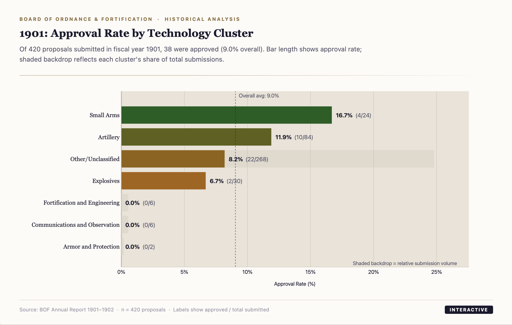
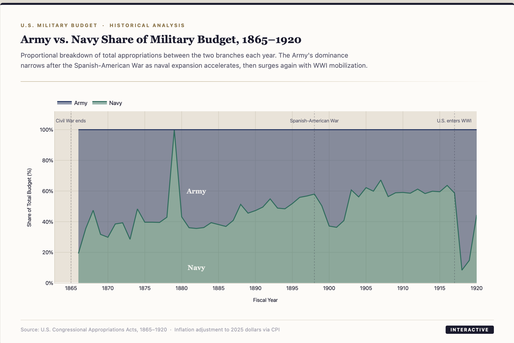
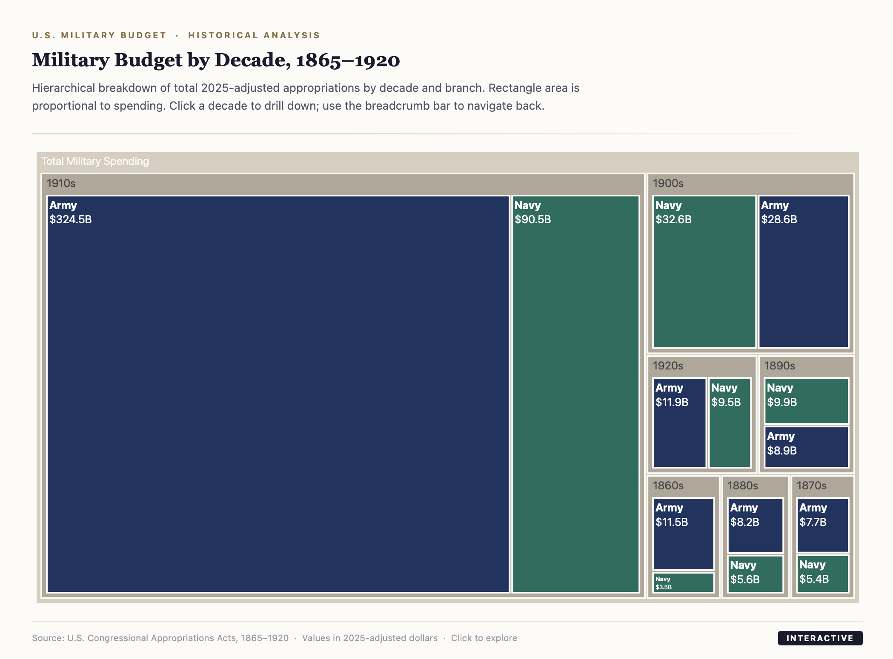
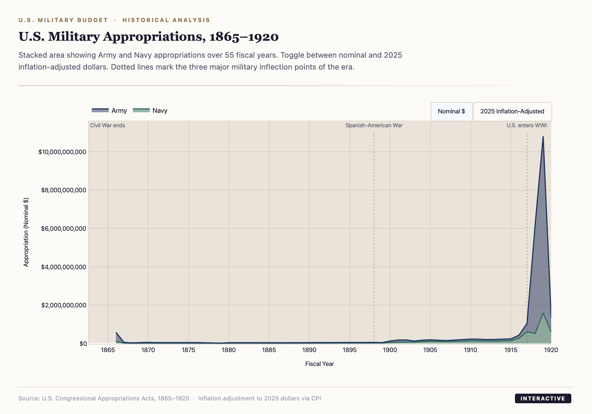

# BOF Archive — Military Visualization

Historical analysis pipeline for U.S. Board of Ordnance & Fortification records (1897–1908) and military budget appropriations (1865–1920).

**Live site:** [smokeybear10.github.io/project.BOFARCHIVE](https://smokeybear10.github.io/project.BOFARCHIVE)

---

## Visualizations

### Proposal Analysis — Subjects Considered, 1897–1908

| | |
|---|---|
|  |  |
| **Proposal Flow — Sankey Diagram** | **Government vs. Private Success Rates** |
|  | |
| **1901 Approval Rate by Technology Cluster** | |

### Budget Analysis — Military Appropriations, 1865–1920

| | |
|---|---|
|  |  |
| **Army + Navy Appropriations Over Time** | **Budget by Decade — Treemap** |
|  | |
| **Army vs. Navy Budget Share** | |

---

## Setup

```bash
python -m venv .venv
source .venv/bin/activate        # Windows: .venv\Scripts\activate
pip install -r requirements.txt
```

---

## Running the Pipelines

### 1. Proposal Analysis (BOF Subjects Considered)

```bash
python run_bof_analysis.py --input-dir Subject --output-dir output
```

### 2. Budget Analysis

```bash
python run_budget_analysis.py --input "Military Budgets, 1865-1920.xlsx" --output-dir output
```

---

## Viewing the Charts

All charts are interactive HTML files in `output/`. Open them by double-clicking, or from the terminal:

```bash
# Mac — open all at once
open output/flow_cluster_to_status.html \
     output/network_proposer_cluster.html \
     output/dashboard_1901_ratio.html \
     output/budget_area_chart.html \
     output/budget_treemap.html \
     output/budget_share_chart.html
```

No server or extra software needed — charts run entirely in the browser.

---

## Output Files

| File | Description |
|------|-------------|
| `output/flow_cluster_to_status.html` | Sankey — proposal flow from technology cluster to board decision |
| `output/network_proposer_cluster.html` | Line chart — Government vs. Private approval rates by year |
| `output/dashboard_1901_ratio.html` | Bar chart — 1901 approval rates by technology cluster |
| `output/budget_area_chart.html` | Stacked area — Army + Navy appropriations 1865–1920 |
| `output/budget_treemap.html` | Treemap — spending by decade and branch |
| `output/budget_share_chart.html` | Proportional area — Army vs. Navy budget share |
| `output/all_structured_records.csv` | Full transformed proposal dataset |
| `output/budget_master_ledger.csv` | Cleaned budget data |

---

## Project Structure

```
project.BOFARCHIVE/
├── index.html                   # GitHub Pages landing page
├── run_bof_analysis.py
├── run_budget_analysis.py
├── requirements.txt
├── Subject/                     # Input: BOF Excel files
├── Graphs/                      # Screenshots of visualizations
├── Military Budgets, 1865-1920.xlsx
├── bof_pipeline/
│   ├── config.py
│   ├── transform.py
│   ├── visualize.py
│   └── budget_visualize.py
└── output/                      # All generated files
```

---

## Customization

- Classification rules (status keywords, technology clusters, proposer patterns) live in `bof_pipeline/config.py`.
- Column name variations are handled automatically. Add new aliases to `COLUMN_ALIASES` in `config.py` if needed.
- Drop additional BOF Excel files into `Subject/` and rerun the pipeline — it batches all files automatically.
